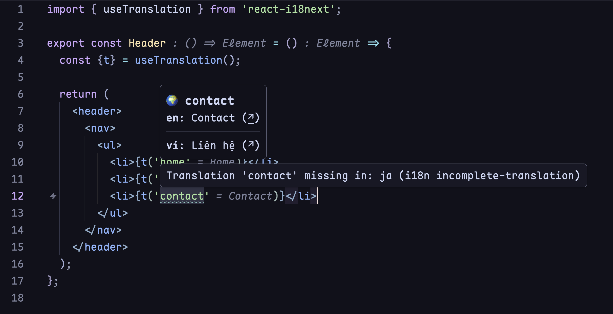
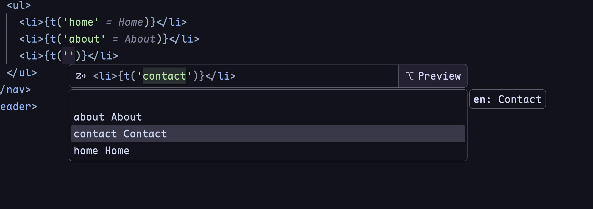

<div align="center">

# 🔍 Intl Lens

**i18n support for Zed Editor - see translations inline.**

[](https://www.rust-lang.org)
[](https://opensource.org/licenses/MIT)
[](https://zed.dev)

Stop guessing what `t("common.buttons.submit")` means.<br/>
**See translations inline. Catch missing keys instantly. Ship with confidence.**

[Features](#-features) · [Install](#-installation) · [Configure](#-configuration) · [Contribute](#-contributing)

</div>

---

## ✨ Features

| Feature | Description |
|---------|-------------|
| 🔍 **Inline Hints** | See translation values right next to your i18n keys |
| 💬 **Hover Preview** | View all locale translations with quick jump links |
| ⚠️ **Missing Key Detection** | Get warnings for undefined translation keys |
| 🌐 **Incomplete Coverage** | Know which locales are missing translations |
| ⚡ **Autocomplete** | Type `t("` and get instant key suggestions with previews |
| 🎯 **Go to Definition** | Jump directly to the translation in any locale file |
| 🔄 **Auto Reload** | Changes to translation files are picked up automatically |

## 🎬 Demo

```tsx
// Before: What does this even mean? 🤔
<button>{t("common.actions.submit")}</button>

// After: Crystal clear! ✨
<button>{t("common.actions.submit")}</button>  // → Submit
```

**Hover over any i18n key to see:**
```
🌍 common.actions.submit

en: Submit (↗)
vi: Gửi (↗)
ja: 送信 (↗)
---
```





## 🚀 Installation

### From Zed Extensions (Recommended)

1. Open Zed
2. Go to Extensions (`cmd+shift+x`)
3. Search for "Intl Lens"
4. Click Install

### Build from Source

```bash
git clone https://github.com/nguyenphutrong/intl-lens.git
cd intl-lens
cargo build --release -p intl-lens
ln -sf $(pwd)/target/release/intl-lens ~/.local/bin/
```

### Configure Zed (Manual Installation)

Add to `~/.config/zed/settings.json`:

```jsonc
{
  "lsp": {
    "intl-lens": {
      "binary": { "path": "intl-lens" }
    }
  },
  "languages": {
    "TSX": {
      "language_servers": ["typescript-language-server", "intl-lens", "..."]
    },
    "TypeScript": {
      "language_servers": ["typescript-language-server", "intl-lens", "..."]
    }
  }
}
```

**Restart Zed. Done. 🎉**

## 🎯 Supported Frameworks

Works out of the box with:

| Framework | Patterns |
|-----------|----------|
| **react-i18next** | `t("key")` `useTranslation()` `<Trans i18nKey="key">` |
| **i18next** | `t("key")` `i18n.t("key")` |
| **vue-i18n** | `$t("key")` `t("key")` |
| **react-intl** | `formatMessage({ id: "key" })` |
| **ngx-translate (Angular)** | `translateService.instant("key")` `translateService.get("key")` `| translate` |
| **Transloco (Angular)** | `translocoService.translate("key")` `selectTranslate("key")` `| transloco` |
| **Laravel** | `__("key")` `trans("key")` `Lang::get("key")` `@lang("key")` |
| **Flutter (gen_l10n)** | `AppLocalizations.of(context)!.key` |
| **easy_localization** | `'key'.tr()` `tr('key')` `context.tr('key')` |
| **flutter_i18n** | `FlutterI18n.translate(context, 'key')` `I18nText('key')` |
| **GetX** | `'key'.tr` `'key'.trParams({})` |
| **Custom** | Configure your own patterns! |

## 🧩 Supported Languages

- TypeScript / TSX
- JavaScript / JSX
- HTML
- Angular templates
- PHP
- Blade
- Dart (Flutter)
- Vue.js

## ⚙️ Configuration

Create `.zed/i18n.json` in your project root:

```json
{
  "localePaths": ["src/locales", "public/locales"],
  "sourceLocale": "en",
  "namespaceEnabled": true
}
```

<details>
<summary><strong>📋 All Options</strong></summary>

| Option | Type | Default | Description |
|--------|------|---------|-------------|
| `localePaths` | `string[]` | `["locales", "i18n", ...]` | Where to find translation files |
| `sourceLocale` | `string` | `"en"` | Your primary language |
| `keyStyle` | `"nested" \| "flat"` | `"auto"` | JSON structure style |
| `namespaceEnabled` | `boolean` | `false` | Prefix keys with the relative file path after the locale segment, e.g. `en/action.json -> action.*` |
| `functionPatterns` | `string[]` | See below | Custom regex patterns |

</details>

<details>
<summary><strong>🔧 Custom Function Patterns</strong></summary>

```json
{
  "functionPatterns": [
    "t\\s*\\(\\s*[\"']([^\"']+)[\"']",
    "translate\\s*\\(\\s*[\"']([^\"']+)[\"']",
    "i18n\\.get\\s*\\(\\s*[\"']([^\"']+)[\"']"
  ]
}
```

</details>

## 📁 Supported File Formats

| Format | Extensions |
|--------|------------|
| JSON | `.json` |
| YAML | `.yaml` `.yml` |
| PHP | `.php` |
| ARB (Flutter) | `.arb` |

**Nested structure:**
```
locales/
├── en/
│   └── common.json
├── vi/
│   └── common.json
└── ja/
    └── common.json
```

**Or flat structure:**
```
locales/
├── en.json
├── vi.json
└── ja.json
```

**Flutter ARB structure:**
```
lib/
└── l10n/
    ├── app_en.arb
    ├── app_es.arb
    └── app_vi.arb
```

## 🛠️ Development

```bash
cargo test          # Run tests
cargo build         # Debug build
cargo build -r      # Release build

# Run with debug logging
RUST_LOG=debug ./target/release/intl-lens
```

## 🤝 Contributing

Contributions are welcome! Here's how:

1. Fork the repository
2. Create your feature branch (`git checkout -b feat/amazing-feature`)
3. Commit your changes (`git commit -m 'feat: add amazing feature'`)
4. Push to the branch (`git push origin feat/amazing-feature`)
5. Open a Pull Request

### Ideas for Contribution

- [ ] Extract hardcoded strings to translation files
- [ ] Support for more file formats (TOML, PO)
- [ ] Namespace support for large projects
- [ ] Translation file validation
- [ ] Integration with translation services

## 📄 License

MIT © [Trong Nguyen](https://github.com/nguyenphutrong)

---

<div align="center">

**If this project helps you, consider giving it a ⭐**

[Report Bug](https://github.com/nguyenphutrong/intl-lens/issues) · [Request Feature](https://github.com/nguyenphutrong/intl-lens/issues)

</div>
